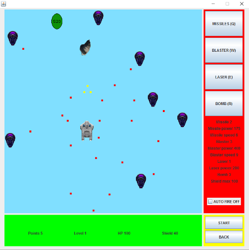

# Space Shooter: JAVA Swing game

My first project in JAVA language. Done as an exercise, before more serious one.
Space Shooter is a small game, in which I tried implement MVC (Model-View-Controller). Project written and compiled in Eclipse framework.

##Used technologies
- Java 7/8
- Swing
- Eclipse IDE

#Controll of a game

Main menu consisting two options: Start game session or Quit

Game session panel. Game will start after START button clicked. Weapons can be chosen by clicking corresponding button, or QWER buttons. By default, Players ship use AutoFire, but it can be turned-off by checking check box. Informations about Player and game status are updated dynamically.

##Player control
- keys: right/up/left/down arrows
- space button for shooting bullets ( if auto fire turned off) and Bombs ( bombs can be shoot only by using space key)
- keys QWER for changing weapon

#Architecture
##Controller section
Controller section consist one main class (GameController) and bunch of listeners (InterfaceListener, MainMenuListener, SessionListener) which are responsible for getting signals and actions of a Player. Therefore, they connect changes in state of game during a session.
The most important one is SessionListenere, which have one Timer instance, which ticks trigger series of methods changing and updating state of game.

##Model section
Model section consist bunch of classes, mainly responsible for calculating state of a game and defining changes in connection to Players actions.

The top level class is GameModel, which is responsible for ordering or doing calculations of every aspects of a game ( setting new Enemies, Bullets, update their position, checking collision etc.). 

Lower level classes, are sub-models (PlayerModel, EnemyModel, BulletsModel, BonusModel) responsible for doing calculations and changes in given corresponding objects (Player, Enemy, Bullet, Bonus). These sub-models are called from top level model (GameModel). Their main purpose is to remove calculations from objects, and move them inside these classes. Thanks to that, the only operations done on (Player, Enemy, Bullet, Bonus) are getters and setters, and update of their current data.

Lowest level are objects (Player, Enemy, Bullet, Bonus), with responsibility of storing current information about state of instance of an object (1 instance for Player, many for rest of these classes). The only methods inside, are getters and setters. In case we want to make a change, we call these methods through corresponding sub-model (PlayerModel, EnemyModel, BulletsModel, BonusModel).

##View section
View section consist classes responsible for building main window (GameView) and subclasses responsible for building UI (MainMenuVew, InterfaceView), and one class responsible for painting current status of a game, on a panel (SceneView).

These subclasses extends JPanel class, so we use @override paintComponent() method to paint objects inside them.
There are connected listeners ( for key and buttons clicks) to these classes, and depending on type of action another action is performed ( shooting bullets, change weapon, Quit game).
